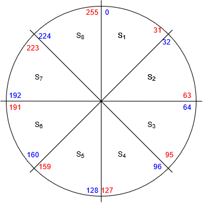

# 03 - IPv4 - Subnetting

The need for subnetting arouse when it was realized there won't be enough IP addresses for every device on the network. **Public** and **private** IP addresses then appeared.

When **subnetting**, one uses **C**lassless **I**nter-**D**omain **R**outing (CIDR) notation. 

The **Broadcast ID** or **Broadcast Address** is used to send data to all devices on a specific network. The entire host portion is populated with binary 1s, so 255.

## Class C Subnetting
To devide a network in two subnets, one can make use of a special subnet mask:
- **Subnet mask**: 11111111.11111111.11111111.10000000
- **CIDR notation**: 192.168.100.0/25

The block size is 2^7 - 2 = 126 hosts. There are now two subnets:
1. - **Network Id 1**: 192.168.100.0
   - **Broadcast Id 1**: 192.168.100.127
2. - **Network Id 2**: 192.168.100.128
   - **Broadcast Id 2**: 192.168.100.255

Possible configurations:
<table>
  <thead>
    <tr>
      <th>Borrowed bits</th>
      <th>0</th>
      <th>1</th>
      <th>2</th>
      <th>3</th>
      <th>4</th>
      <th>5</th>
      <th>6</th>
    </tr>
  </thead>
  <tbody>
    <tr>
    	<th>Block Size</th>
      <td>256</td>
    	<td>128</td>
    	<td>64</td>
    	<td>32</td>
    	<td>16</td>
    	<td>8</td>
    	<td>4</td>
    </tr>
    <tr>
    	<th>Subnets</th>
      <td>0</td>
    	<td>2</td>
    	<td>4</td>
    	<td>8</td>
    	<td>16</td>
    	<td>32</td>
    	<td>64</td>
    </tr>
    <tr>
    	<th>Hosts</th>
      <td>254</td>
    	<td>126</td>
    	<td>62</td>
    	<td>30</td>
    	<td>14</td>
    	<td>6</td>
    	<td>2</td>
    </tr>
    <tr>
    	<th>CIDR</th>
      <td>/24</td>
    	<td>/25</td>
    	<td>/26</td>
    	<td>/27</td>
    	<td>/28</td>
    	<td>/29</td>
    	<td>/30</td>
    </tr>
    <tr>
    	<th>Mask Value</th>
      <td>255</td>
    	<td>128</td>
    	<td>192</td>
    	<td>224</td>
    	<td>240</td>
    	<td>248</td>
    	<td>252</td>
    </tr>
  </tbody>
</table>

### Example

- **Question**: Find the NID and BID of the following IP Address: 192.168.225.212/27.

The CIDR notation indicates a binary subnet mask with 27 ones, meaning three borrowed bits:
- Subnet mask (binary): 11111111.11111111.11111111.11100000

Three borrowed bits mean 5 zero-bits and this gives a block size of 2^5 - 2 = 30 hosts in each one of the eight subnets:

The blue text indicates the **N**etwork **ID**s, the red text indicates the **B**roadcast **ID**s. The IP Address above lies in subnet S7, with NID 192.168.225.192 and BID 192.168.225.223.
